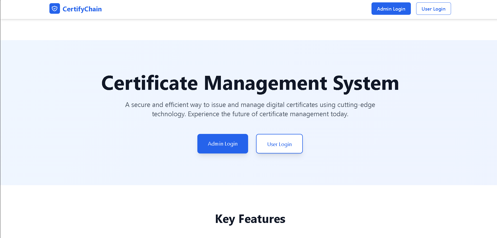

# 🔐 CertifyChain - Certificate Management System

<div align="center">
  
</div>

## 🚀 Overview

A secure and efficient way to issue and manage digital certificates using cutting-edge blockchain technology. Experience the future of certificate management today.

## ✨ Key Features

- 🛡️ **Secure Authentication**: Multi-factor authentication for enhanced security
- 📜 **Certificate Management**: Easy issuance and verification of digital certificates
- 👥 **User-Friendly Portals**: Separate interfaces for admins and users
- 📊 **Analytics Dashboard**: Track and monitor certificate statistics
- 🔍 **Instant Verification**: Quick and reliable certificate validation
- 🌐 **Blockchain Technology**: Immutable and transparent certificate records

## 🛠️ Tech Stack

- Frontend: React.js with TypeScript
- Styling: Tailwind CSS
- Backend: Node.js
- Database: MongoDB
- Blockchain: Ethereum Smart Contracts

## 🚀 Getting Started

1. **Clone the Repository**
   ```bash
   git clone https://github.com/Sanjanabonagiri16/CertifyChain.git
   cd CertifyChain
   ```

2. **Install Dependencies**
   ```bash
   npm install
   ```

3. **Configure Environment**
   - Create `.env` file
   - Set up required environment variables

4. **Run Development Server**
   ```bash
   npm run dev
   ```

## 📸 Contributing

Contributions are welcome! Feel free to:
- Fork the repository
- Create a feature branch
- Submit a pull request

## 📄 License

This project is licensed under the MIT License - see the [LICENSE](LICENSE) file for details.

## 📞 Contact

For any queries or support, please reach out to us:
- Email: support@certifychain.com
- GitHub: [@Sanjanabonagiri16](https://github.com/Sanjanabonagiri16) 